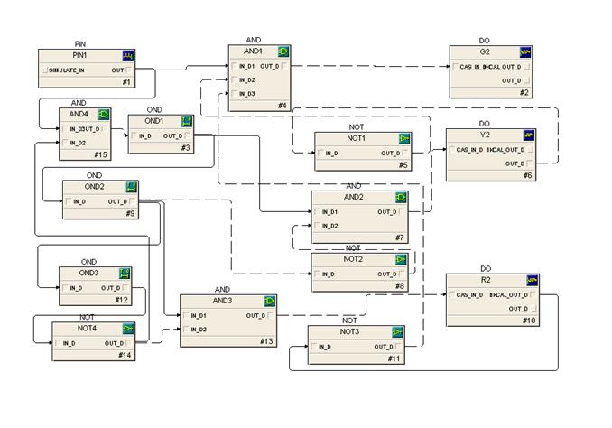

### The procedure for using simulator is as follows:

* One of the possible solutions implemented using **EMERSON DELTA V DCS** is shown below. Refer to the procedure in experiments 3 related to timer and counter function implementation. Configure the logic as shown below and see the result. You can also try different logic to get the results.
Instead of PIN block used in the solution, make use of DI block available in simulator.

 
* The lamp G2 is on when system is started. When 25 sec time is elapsed (indicated by OND Timer block), lamp Y2 is switched on and G2 is switched off.
OND block is used to switch on lamp R2 and switch off lamp Y2 after a delay of 5 sec. The lamp R2 is kept on for 30 sec and after this delay the cycle is repeated.
Another OND block with logical AND block is used to implement this. To get negated output status NOT block is used. This is the logic for one lamp post. In the similar manner it can be implemented for another lamp post.