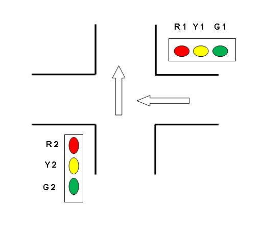
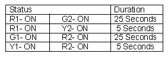

Previous three experiments cover the basic hardware and software information along with the functions
block available in DCS. This information can be applied for logic development in specific application.
Traffic light control is one common example where timer function can be used.
Consider the traffic lights situation as shown below.

There are two lamp posts as shown in the diagram. Consider a case where the lamp R1
is off. As the lamp R1 is off,lamp G2 will be on to allow the traffic from south to north.
The lamp on-off sequence is as follows.

For implementing this logic using function blocks, on delay times can be used.

**Solution Hint:**
For starting the Traffic Control System in auto mode use Pulse Input Block.
For the lamps, Digital Output blocks can be used.